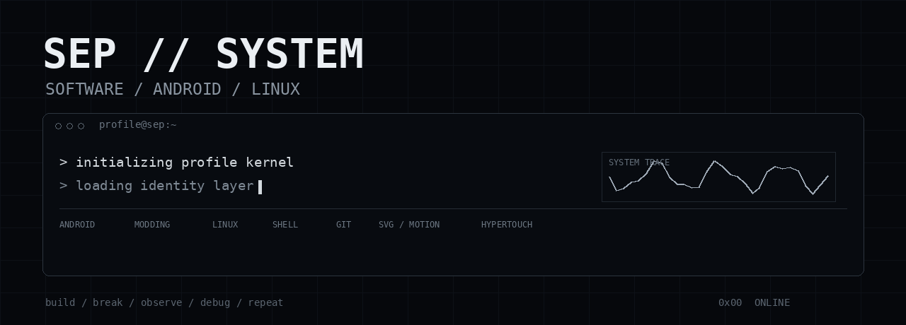
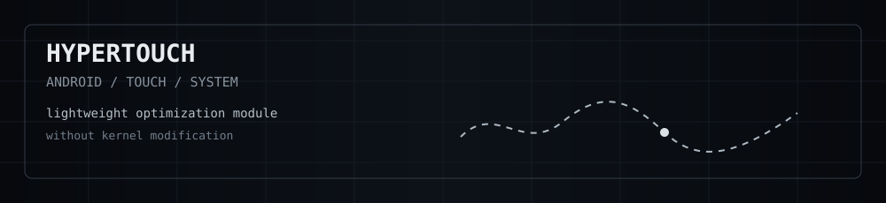

<p align="center">
  
</p>

<p align="center">
  <code>software / android / linux / systems</code>
</p>

---

## About

I'm Sep.

A software enthusiast interested in Android, Linux, system modding,
debugging and learning how things work underneath the surface.

I enjoy experimenting with Android and HyperOS, building small tools,
breaking things on purpose, finding out why they break, and turning
those experiments into useful projects.

```text
focus
├── software development
├── Android / HyperOS
├── system modding
├── Linux / shell
├── Git / GitHub
├── debugging
└── SVG / animation / UI experiments
```

## Current project

<p align="center">
  
</p>

### HyperTouch

A lightweight Android touch optimization module focused on touch
response and overall system responsiveness without requiring kernel
modification.

[View repository](https://github.com/sandtomatowich-hubexe/HyperTouch)

## Stack / interests

```text
ANDROID       HYPEROS       LINUX
SHELL         GIT           GITHUB
PYTHON        DEVOPS        SYSTEM MODDING
DEBUGGING     SVG           ANIMATION
```

## Currently learning

```text
Linux        █████████░
Git          ██████████
Shell        ████████░░
Android      █████████░
Python       ████░░░░░░
DevOps       ███░░░░░░░
```

These bars are only a visual snapshot of what I'm currently spending
time on, not a claim of proficiency.

## Workflow

```text
build
  ↓
break
  ↓
observe
  ↓
debug
  ↓
understand
  ↓
repeat
```

## Elsewhere

[GitHub](https://github.com/sandtomatowich-hubexe)

---

<p align="center">
  <sub>SEP // SYSTEM</sub>
</p>
