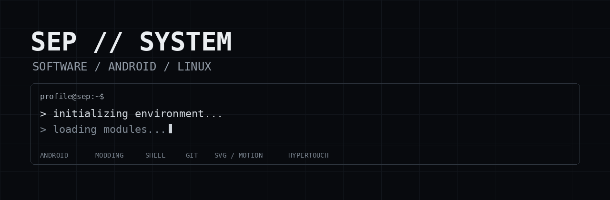
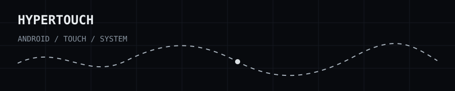

<p align="center">
  
</p>

<p align="center">
  <code>software / android / linux / systems</code>
</p>

---

## About

I'm Sep — a software enthusiast interested in Android, Linux, system
modding and learning how software behaves underneath the surface.

I like taking things apart, changing them, testing what happens, and
turning the useful parts into small projects.

```text
focus
├── software development
├── Android / HyperOS modding
├── Linux / shell
├── Git / GitHub
├── system-level experimentation
└── SVG / animation / UI experiments
```

## Current project

<p align="center">
  
</p>

### HyperTouch

A lightweight Android touch optimization module focused on touch response
and overall system responsiveness, without requiring kernel modification.

[View HyperTouch](https://github.com/sandtomatowich-hubexe/HyperTouch)

## What I'm learning

```text
Linux        █████████░
Git          ██████████
Shell        ████████░░
Android      █████████░
Python       ████░░░░░░
DevOps       ███░░░░░░░
```

These are not skill ratings. They are simply a visual snapshot of what
I'm currently spending time on.

## Interests

`Android` `HyperOS` `Linux` `Shell` `Git` `GitHub`
`System Modding` `Debugging` `SVG` `Animation` `Software`

## Philosophy

```text
build
break
observe
debug
repeat
```

Still learning. Still experimenting.

---

<p align="center">
  <sub>SEP // SYSTEM</sub>
</p>
